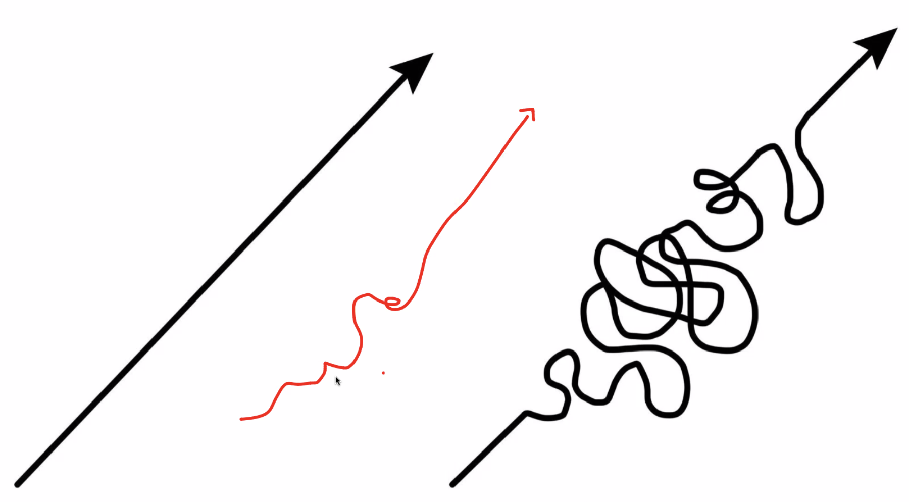

# A growth mindset is
* believing you can learn, grow and improve via effort.
* not giving up when you're not initially good at something.
* embracing the idea that mistakes, failure and hard work are the way to get to personal growth and success.
* these things especially when you feel inadequate in the thing you're trying to do or learn or succeed in.

*Reference:* Mindset: The New Psychology of Success by Carol S. Dweck, PhD.

# Bits of advice from the CF team:
- Prepare to fail. It's part of learning.
- Failure is an event not a person.
- Press the "I believe button"
- Take it one day at a time.
- You'll get good at it, and the it will forever keep changing. Never stops.
- Let comparisons go and be inspired from the people around you.
- Its about pressing through together.
- Do not suffer in silence.
     - How to ask for help: 1, what was supposed to happen, 2, what is happening, 3, how can I help?
- Spaghetti code. Make it work - Jr dev example on right. Not a straight line. Sr. dev is red line.

- I'm going to swim in jello today! - John Cokos on embracing growth mindset.
- Sometimes the best way to lead is to be led.

### Course tips:
- Always stay current. Turn in, get critical feedback, one more iteration, turn in, then move on.
- Most days: Reading, Lab, Journal. Sometimes quizes and other.
- For wireframe in 201 miro +, for whiteboard interviews invisionapp +
- Leave comments in code for Kim as though she's my coworker coming in for the night shift.
- This week do well done reading and well done notes and get rhythm with Kim and Brandon so when it gets hard we're already in the ggrroove.

## Goal
Be a positive light in my class through it all.
